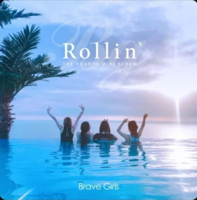

This is H1
===

This is H2
---

* This is H1
**** This is H2

> This is a first blockqute.
>	> This is a second blockqute.
>	>	> This is a third blockqute.


```
public class BootSpringBootApplication {
  public static void main(String[] args) {
    System.out.println("Hello, Honeymon");
  }
}
```


# 소개



* 권지훈
* Email : misas777@gmail.com
* Github : [github.com/alexk77777](https://github.com/alexk77777/firstrepo)


# 경력
* [EMK holdings]
    - 마케팅 & 경영관리
    - 기간 : 2016.1-
* [씨제이]
    - 마케터 / BM
    - 기간 : 20xx ~ 2015.12

# 운동 계통 취미
* [농구]
    - 너무 좋아하는 운동. 내 주무기는 스피드.
       하지만 요즘 애들 몸이 너무 좋아서 같이 하기 계속 힘들어진다 ㅠ.ㅠ
* [골프]
    - 굉장히 섬세한 운동. 매일 연습장에서 1시간 200개씩 때리는 중. 언젠가는 잘 치겠지..
* [휘트니스]
    - 한국인이라면 영원한 숙제. 6팩 만들기. 계속 도전 중..


# 인생 프로젝트
## buravel project
`버라벨, 2021.2-`
지인들끼리 모여 제 인생 첫 프로젝트로 기획총괄인 Project Manager를 담당하고 있습니다.

## being a flutter programmer
 내 아이디어를 구현할 플러터 프로그래머가 된다!
 프론트 뿐 아니라 백도 구현하여 혼자서 앱출시 가능하게 한다!


